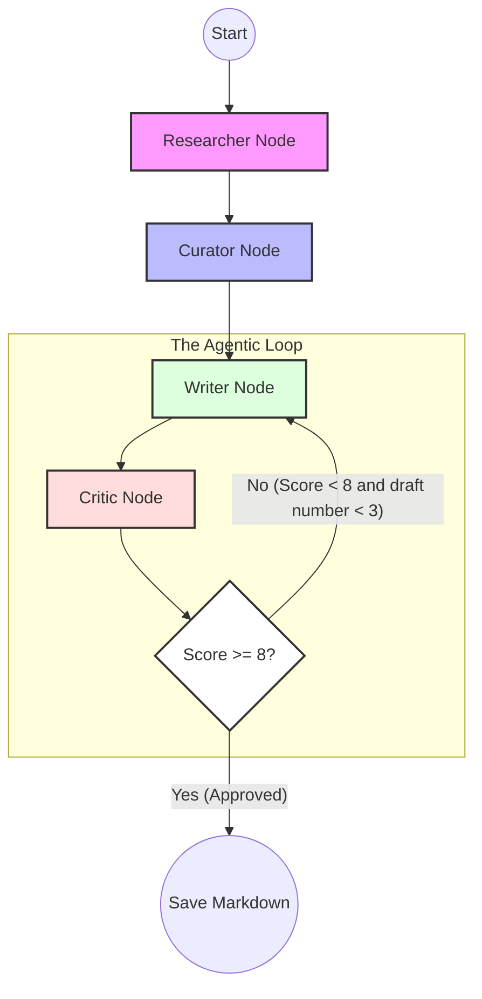

# GraphNews: A Multi-Agent Self-Correcting Editorial Team


**GraphNews** is a sophisticated multi-agent system built with **LangGraph** that automates the end-to-end process of news research, curation, and newsletter drafting. Unlike standard linear AI chains, this project utilizes a **Cyclic Graph** architecture to implement a "Self-Correction" loop, ensuring high-quality, factual output through autonomous peer review.

## Workflow Architecture
The system treats the editorial process as a state machine. Data flows through specialized nodes, maintaining a shared state to ensure context is preserved across the entire lifecycle:

1.  **RESEARCHER:** Scours the web using **Tavily** for the top 10 .
2.  **CURATOR:** Filters research results to select the top 5 most relevant sources.
3.  **WRITER:** Generates a structured Markdown draft based on curated items.
4.  **CRITIC:** Evaluates the draft. If the score is **< 8/10**, the draft is sent back to the **WRITER** with specific feedback for revision.
5.  **FINALIZE:** Once the quality threshold is met, or we reach the 3rd draft (to avoid infinite loops), the final newsletter is saved to disk.



## Tech Stack
* **Orchestration:** LangGraph (Stateful Multi-Agent Workflows)
* **LLM:** DeepSeek-V3.2
* **Search Engine:** Tavily AI (Search API for LLMs)
* **Language:** Python

## Quick Start

### 1. Clone & Install
```bash
git clone https://github.com/simonsl07/InsightLoop.git
cd InsightLoop
pip install -r requirements.txt
```
### 2. Create a .env file following the .env.example file
```
DEEPSEEK_API_KEY=your_key_here
TAVILY_API_KEY=your_key_here
```

### 3. Run the system
```bash
python main.py
```

## Technical Challenges & Solutions
- The "Hallucination" Brake: Implemented a max revision counter within the Critic node logic to prevent infinite loops and runaway API costs.
- Deterministic State Control: Used LangGraph's TypedDict state to maintain a single source of truth, preventing context drift.

## Roadmap
 - Add CLI arguments to control news topic and source count.
 - Integrate LangSmith for full-trace agent debugging and cost monitoring.
 - Human-in-the-Loop: Add a LangGraph Checkpointer to pause for human approval before final output.

